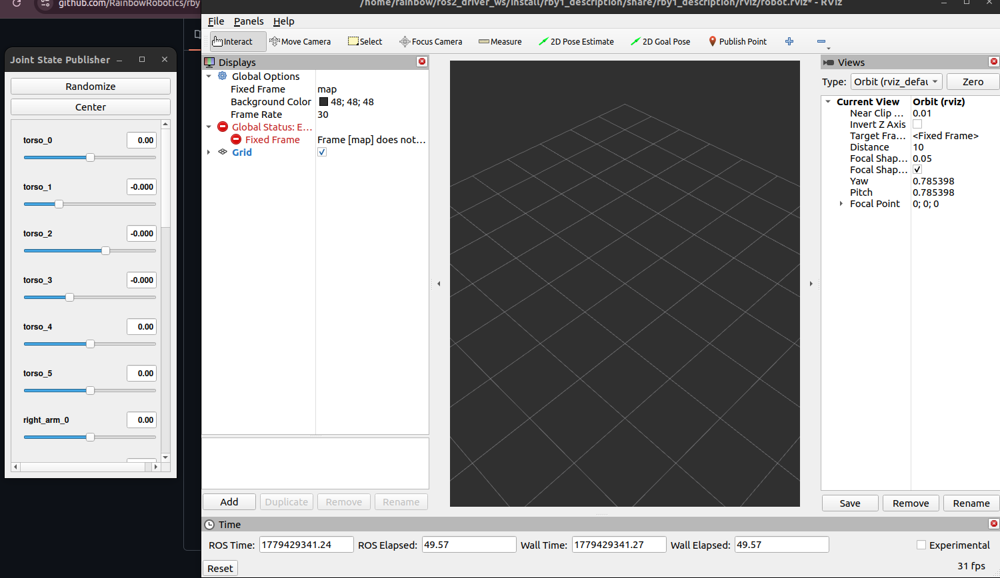
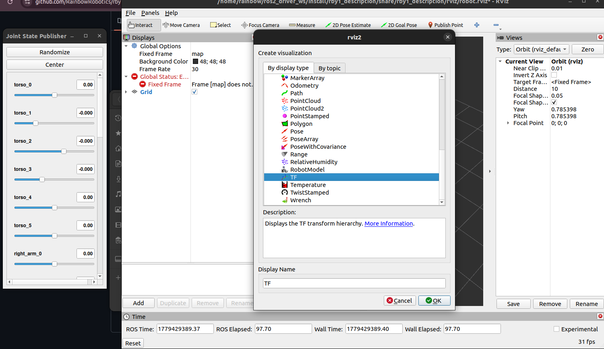
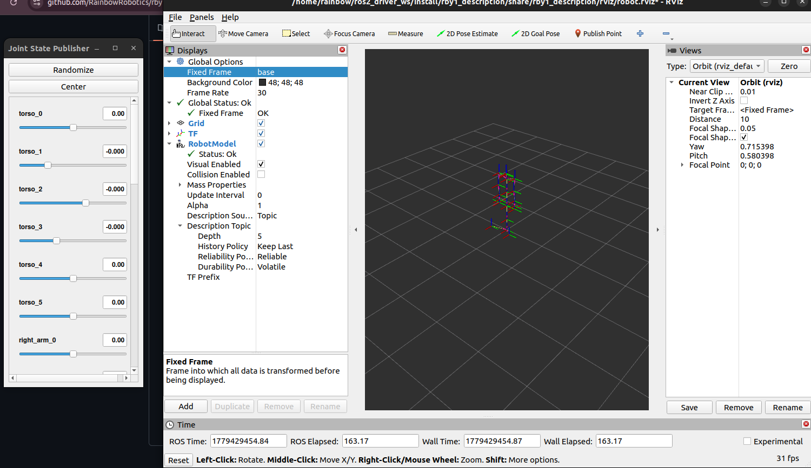
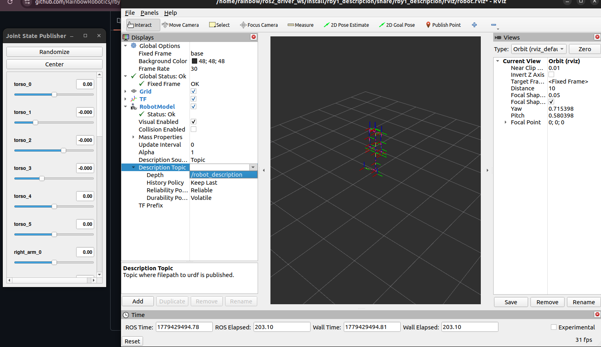
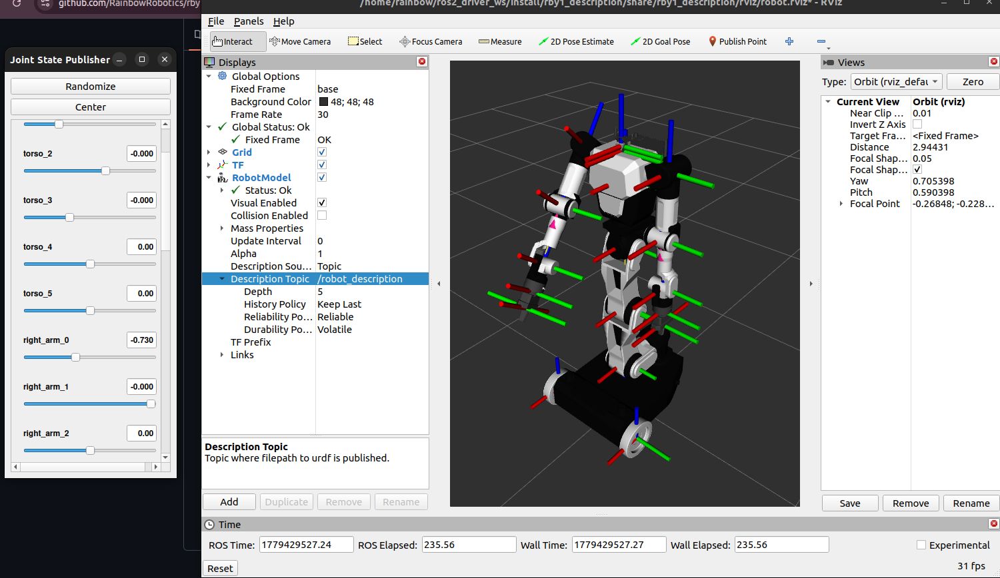
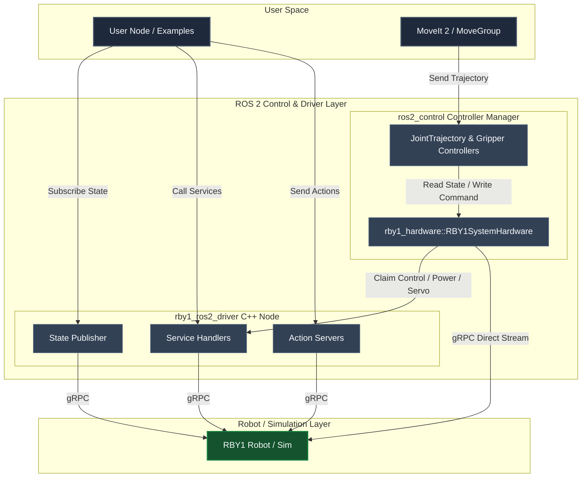

# RBY1 ROS 2 Driver Package

## Overview

`rby1_ros2` is a unified ROS 2 driver package for controlling the Rainbow Robotics RBY1 robot.  
It wraps the RBY1 C++ SDK into a ROS 2 node, providing state monitoring and multiple control modes (Joint Position, Cartesian Position, Impedance, Gravity Compensation, and Trajectory Streaming) through a clean action/service/topic interface.

- **ROS 2 version**: Humble
- **OS**: Ubuntu 22.04
- **SDK compatibility**: rby1-sdk `0.10.x` and later


The system operates using two primary pipelines to interface with the robot:
1. **Direct Control Mode (`rby1_ros2_driver`)**: A standalone C++ ROS 2 node that communicates directly with the RBY1 robot or simulator via gRPC. User applications/scripts send standard ROS 2 topics, services, and actions (e.g. `robot_joint`, `robot_cartesian`) to command movements and monitor status.
2. **MoveIt 2 Integration (`rby1_hardware`)**: Bridges MoveIt 2 and `ros2_control` to the robot via a custom `RBY1SystemHardware` interface plugin. The hardware plugin streams command inputs to the robot via a direct gRPC connection, while querying status and coordinating power, servo states, and control rights with the `rby1_ros2_driver` node via internal ROS 2 service calls (like `/hardware_control`).

---


## Examples

Each example can be run in a **separate terminal** while the driver is active:
```bash
source install/setup.bash
ros2 run rby1_examples <example_name>
```

The values an example uses — postures, times, speeds, priorities, how long it waits before a cancel — are constants in one block at the top of its file, under the imports (`# Values to change: edit these to adjust the example.`). Examples 15 and 16 take theirs as ROS parameters; the block holds their defaults.

| Example | Command | Description |
|---------|---------|-------------|
| `01_power_control` | `ros2 run rby1_examples 01_power_control` | Full power lifecycle: Power ON/OFF, Servo ON/OFF |
| `02_robot_status_monitor` | `ros2 run rby1_examples 02_robot_status_monitor` | Continuously prints state monitor (Motor state, brakes, battery, etc) |
| `03_tool_flange_monitoring` | `ros2 run rby1_examples 03_tool_flange_monitoring` | Continuously prints tool flange data |
| `04_joint_state_monitoring` | `ros2 run rby1_examples 04_joint_state_monitoring` | Prints per-component joint positions in real time |
| `05_gravity_compensation` | `ros2 run rby1_examples 05_gravity_compensation` | Enables/Disable gravity compensation mode |
| `06_zero_pose` | `ros2 run rby1_examples 06_zero_pose` | Moves all joints to 0 rad simultaneously |
| `07_joint_command` | `ros2 run rby1_examples 07_joint_command` | Sends Ready Pose with joint_position(right), joint_impedance(left) |
| `08_cartesian_command` | `ros2 run rby1_examples 08_cartesian_command` | Sends Ready Pose and moves the arms to a target Cartesian pose with cartesian_position(right), cartesian_impedance(left)|
| `09_multi_controls` | `ros2 run rby1_examples 09_multi_controls` | Simultaneous joint + Cartesian control per body part |
| `10_trajectory_joint_command` | `ros2 run rby1_examples 10_trajectory_joint_command` | Streams a pre-computed trajectory via standard FollowJointTrajectory action |
| `11_cancel_control` | `ros2 run rby1_examples 11_cancel_control` | Demonstrates action cancel and `cancel_control` service |
| `12_mobile_base_control` | `ros2 run rby1_examples 12_mobile_base_control` | Drives the mobile base via `cmd_vel`|
| `13_stream_command` | `ros2 run rby1_examples 13_stream_command` | Alternates Zero/Ready poses using regular joint commands over persistent stream with varying wait intervals |
| `14_collision_safety_control` | `ros2 run rby1_examples 14_collision_safety_control` | use collision value in robot.state, Demonstrates that when collision happens, robot automatically moves retreat to initial safe pose.  |
| `15_cartesian_target_move` | `ros2 run rby1_examples 15_cartesian_target_move` | The simplest target executor: takes hand targets from `/rby1/right_arm/target_pose` until Ctrl+C and moves the hand to each with the driver alone, `mode:=command` (one `robot_cartesian` command) or `mode:=stream` (`stream_cartesian` steps). Answers on `/rby1/right_arm/target_status`. No planner, no collision check |
| `16_target_shuttle_publisher` | `ros2 run rby1_examples 16_target_shuttle_publisher` | Publishes two hand poses in turn on `/rby1/right_arm/target_pose`, one every `period` seconds, for example 15 or a target executor to carry out. It only publishes, and logs the answers. `cycles:=1` for two targets |

---

> [!IMPORTANT]
> **Two ways to stop control commands (see Example : 11_cancel_control):**
> 1. **Action cancel** — Cancels only the current action goal. The stream remains open, so subsequent commands can continue immediately.
> 2. **`cancel_control` service** — Immediately stops all control commands **and forcibly closes the stream** for safety.
>
> ⚠️ **If you are using stream-based control (e.g., `cmd_vel`, Example 13), calling `cancel_control` will also shut down the stream.**  
> You will need to re-open the stream (`/stream_control state: true`) before sending further commands.  
> If you only want to pause or cancel a specific motion while keeping the stream alive, use the action cancel instead (see Example 13).
>
> If an issue arises, please check the [Troubleshooting & Known Issues](#troubleshooting) section to see if there is any relevant information.

> [!NOTE]
> **Simulator Limitation**: Battery voltage, FT sensor, and IMU data read as `0.0` in simulation (no physical hardware).
> **Tool flange topics**: Requires `publish_tool_flange_state: true` in `driver_parameters.yaml`.

---


## Visualization & Robot Description (`rby1_description`)

You can use the robot's basic TF structure and state publisher through the commands below. When implementing features related to rby1, please use the model files from the corresponding package.

- **Parameters**:
  - `model_name` : `rby1a`, `rby1m`
  - `model_version`
    - `rby1a` : `1.0`, `1.1`, `1.2`
    - `rby1m` : `1.0`, `1.1`, `1.2`, `1.3`

```bash
source install/setup.bash
ros2 launch rby1_description rby1_state_publisher.launch.py model:=a version:=1_1
```

1. If you launch this command, you can see the following window:



2. Click 'Add', and add plugins `TF` and `RobotModel`:



3. Click 'Fixed Frame' and set to `base`:



4. Click 'RobotModel', and select Topics -> `/robot_description`:



5. You can now control the robot model using the joint state publisher GUI:



---

## RB-Y1 MoveIt 2 (`rby1_hardware` + `rby1_moveit_*`)

The `rby1_hardware` package provides a `ros2_control` `SystemInterface` plugin (`rby1_hardware/RBY1SystemHardware`) that bridges the RBY1 SDK to MoveIt 2 via the standard `ros2_control` pipeline.  
Each `rby1_moveit_*` package contains the complete MoveIt 2 configuration (SRDF, kinematics, joint limits, controller configs) for a specific model and version.


### Available MoveIt Packages

| Package | Model | Version |
|---------|-------|---------|
| `rby1_moveit_a_1_0` | RBY1-A | 1.0 |
| `rby1_moveit_a_1_1` | RBY1-A | 1.1 |
| `rby1_moveit_a_1_2` | RBY1-A | 1.2 |
| `rby1_moveit_m_1_0` | RBY1-M | 1.0 |
| `rby1_moveit_m_1_1` | RBY1-M | 1.1 |
| `rby1_moveit_m_1_2` | RBY1-M | 1.2 |
| `rby1_moveit_m_1_3` | RBY1-M | 1.3 |

### Launch MoveIt with Real Hardware

> [!IMPORTANT]
> **Real hardware mode** requires `rby1_driver` to be running first.  
> `RBY1SystemHardware` claims hardware control from the driver via the `/hardware_control` service on activation.
> Please check robot ip & model in `rby1_driver/config/driver_parameters.yaml`
> After check, please change ip in demo.launch.py
>
> [!WARNING]
> **Version mismatch risk**: The `rby1_hardware` plugin cannot verify the connected robot's version at runtime.  
> If the `rby1_moveit_*` package version does not match the actual robot's version, MoveIt and the robot may be activated with different joint/kinematic configurations, which could cause unexpected commands to be sent to the robot.  
> **Always ensure the `rby1_moveit_*` package version matches the robot's version before launching with real hardware.**

**Step 1** — Start the driver (first terminal):

```bash
source install/setup.bash
ros2 launch rby1_driver rby1_ros2_driver.launch.py
```

**Step 2** — Launch MoveIt (second terminal), selecting the package that matches your model and  version:

```bash
# open another terminal
source install/setup.bash

# Real hardware (default: use_fake_hardware:=false)
ros2 launch rby1_moveit_m_1_2 demo.launch.py

# With a custom robot IP
ros2 launch rby1_moveit_m_1_2 demo.launch.py robot_ip:=192.168.30.1:50051

# Fake hardware / simulation (no real robot required)
ros2 launch rby1_moveit_m_1_2 demo.launch.py use_fake_hardware:=true
```

Replace `rby1_moveit_m_1_2` with the package matching your robot.

### Launch Arguments

| Argument | Default | Description |
|----------|---------|-------------|
| `use_fake_hardware` | `false` | `true` = `mock_components/GenericSystem` (no robot needed); `false` = `RBY1SystemHardware` (real robot) |
| `robot_ip` | `127.0.0.1:50051` | RBY1 SDK gRPC address and port |
| `model` | `m` or `a` | Robot model type passed to the hardware plugin |
| `driver_namespace` | `rby1` | Top-level namespace of the robot driver node, topics, and services. |


### ros2_control Controllers

Each MoveIt package spawns the following controllers:

| Controller | Type | Controlled Joints |
|------------|------|------------------|
| `right_arm_controller` | `JointTrajectoryController` | right_arm_0 ~ ee_right |
| `left_arm_controller` | `JointTrajectoryController` | left_arm_0 ~ ee_left |
| `torso_controller` | `JointTrajectoryController` | base ~ torso_5 |
| `head_controller` | `JointTrajectoryController` | head_0, head_1 |
| `gripper_r_controller` | `GripperActionController` | gripper_finger_r1_joint |
| `gripper_l_controller` | `GripperActionController` | gripper_finger_l1_joint |
| `both_arms_controller` | `JointTrajectoryController` | All arm joints (left + right) |
| `body_controller` | `JointTrajectoryController` | Torso + Head + Both Arms |


## Package Architecture

### System Architecture

The RBY1 ROS 2 package supports both direct control (via stand-alone services, actions, and topics in the `rby1_ros2_driver` C++ node) and MoveIt 2 motion planning (via the standard `ros2_control` pipeline and `rby1_hardware::RBY1SystemHardware` system interface).

### Package Structure

| Package | Role |
|---------|------|
| `rby1_driver` | C++ main driver node. Wraps the RBY1 SDK and exposes a ROS 2 interface. |
| `rby1_msgs` | Custom message, service, and action definitions for robot control and state. |
| `rby1_examples` | Python example scripts demonstrating all major driver features. |
| `rby1_description` | Robot description for ROS, demonstrating URDF and Mesh files, and simple visualization launch file. |
| `rby1_hardware` | `ros2_control` SystemInterface plugin (`RBY1SystemHardware`). Bridges the RBY1 SDK to MoveIt 2 via the standard `ros2_control` hardware interface pipeline. |
| `rby1_moveit_a_1_0` | MoveIt 2 configuration package for **Model A v1.0** (SRDF, controllers, kinematics, joint limits). |
| `rby1_moveit_a_1_1` | MoveIt 2 configuration package for **Model A v1.1**. |
| `rby1_moveit_a_1_2` | MoveIt 2 configuration package for **Model A v1.2**. |
| `rby1_moveit_m_1_0` | MoveIt 2 configuration package for **Model M v1.0**. |
| `rby1_moveit_m_1_1` | MoveIt 2 configuration package for **Model M v1.1**. |
| `rby1_moveit_m_1_2` | MoveIt 2 configuration package for **Model M v1.2**. |
| `rby1_moveit_m_1_3` | MoveIt 2 configuration package for **Model M v1.3**. |
| `rby1_moveit_executor` | Target executor: plans with MoveIt (OMPL) to a 4x4 tool pose target and executes through the driver's `follow_joint_trajectory` action. C++. |
| `rby1_moveit_objects` | Objects in the MoveIt planning scene: the `scene` command (obstacles: add, move, remove, load a file), modules on robot links and fixtures in the world from a YAML file, kept in the scene while it runs, and one obstacle kept where a point topic says. C++, with a library. |
| `rby1_additional_tools` | Camera publishers (webcam through OpenCV, Intel RealSense through librealsense) and the camera mount on TF. C++. |

#### Sequence & Architecture Flow (Mermaid Diagram)


## Config/driver_parameters.yaml

| Parameter | Default | Unit | Description |
|-----------|---------|------|-------------|
| `robot_ip` | `"127.0.0.1:50051"` | - | Robot IP address and gRPC port |
| `model` | `"m"` | - | Robot model — `"a"` (RBY1-A) or `"m"` (RBY1-M) |
| `get_state_period` | `0.01` | s | State publish interval — default 0.01 (100 Hz) |
| `minimum_time` | `2.0` | s | Default minimum execution time for motion commands |
| `stream_hz` | `30.0` | Hz | Frequency for trajectory streaming |
| `angular_velocity_limit` | `4.712388` | rad/s | Joint angular velocity limit |
| `linear_velocity_limit` | `1.5` | m/s | Cartesian linear velocity limit |
| `acceleration_limit` | `1.0` | - | Acceleration scaling factor |
| `stop_orientation_tracking_error` | `1e-5` | rad | Orientation tracking error threshold to detect stop |
| `stop_position_tracking_error` | `1e-5` | m | Position tracking error threshold to detect stop |
| `se2_minimum_time` | `1.0` | s | Minimum execution time (interpolation ramp) for SE2 velocity commands |
| `se2_linear_acceleration_limit` | `0.5` | m/s² | Linear acceleration limit for SE2 velocity commands |
| `se2_angular_acceleration_limit` | `0.5` | rad/s² | Angular acceleration limit for SE2 velocity commands |
| `fault_reset_trigger` | `false` | - | Auto-reset MAJOR/MINOR fault on driver startup |
| `collision_threshold` | `0.02` | m | Minimum link-distance threshold for collision detection |
| `publish_battery_state` | `true` | - | Enable battery state topic |
| `publish_tool_flange_state` | `true` | - | Enable tool flange state topics (left + right) |
| `state_loss_timeout` | `1.0` | s | The driver stops only after state reads kept failing this long (a single failed read is retried) |
| `fjt_start_velocity_scale` | `1.0` | - | `follow_joint_trajectory` is rejected when reaching its first waypoint in time would need more than this share of a joint's velocity limit |

## Key Features

### Robot Control
- **Joint Position Control**: Command each body part (Torso, Right/Left Arm, Head) to target joint angles (rad) via the `robot_joint` action. All parts can be commanded simultaneously in one goal.
- **Cartesian Position Control**: Command end-effector pose as a 4×4 SE3 transform via the `robot_cartesian` action.
- **Impedance Control**: Both joint and Cartesian modes support impedance control with configurable stiffness and damping.
- **Gravity Compensation**: Enables back-drivable joints for direct teaching; the driver continuously compensates gravity.
- **Trajectory Streaming**: Send a pre-computed `JointTrajectory` (multi-waypoint) via the standard `follow_joint_trajectory` action.
- **Mobile Base + Upper Body Simultaneous Control**: While driving the base via `cmd_vel`, you can also command the arms/head via the `robot_joint` action at the same time. Set `priority = 1` on upper-body goals to match the mobile base's default priority.

### Safety & Fault Management
- Motion commands are rejected if the Control Manager is not in `ENABLE` or `EXECUTING` state.
- Minor faults encountered during execution are automatically reset and control is resumed.

#### Predictive Collision Checking
The driver checks the **target pose** for collisions *before* executing any joint or Cartesian command:
- **Joint commands**: uses the URDF-based dynamics model to evaluate the target joint configuration for link collisions.
- **Cartesian commands**: solves the Inverse Kinematics via the built-in optimal control solver to obtain joint angles, then evaluates those angles for collisions.
- If the predicted configuration is in collision (minimum distance below the threshold), the driver prints a warning log (`RCLCPP_WARN`) rather than aborting or rejecting the command, allowing safer manual intervention.
- ⚠️ This check runs at the same rate as `get_state_period`. A slow period means the check fires less frequently.

## Topics 

### Publishers
| Topic | Type | Always Active | Description |
|-------|------|:---:|-------------|
| `joint_states` | `sensor_msgs/JointState` | ✅ | Consolidated state of all joints of the robot |
| `joint_states/torso` | `sensor_msgs/JointState` | ✅ | Torso joint positions, velocities, torques |
| `joint_states/right_arm` | `sensor_msgs/JointState` | ✅ | Right arm joint state |
| `joint_states/left_arm` | `sensor_msgs/JointState` | ✅ | Left arm joint state |
| `joint_states/head` | `sensor_msgs/JointState` | ✅ | Head joint state |
| `robot_state` | `rby1_msgs/RobotState` | ✅ | Control Manager state, brakes, EMO, CoM, stream, collision |
| `battery_state` | `sensor_msgs/BatteryState` | ⚙️ `publish_battery_state` | Battery voltage, current, percentage |
| `tool_flange/left` | `rby1_msgs/ToolFlangeState` | ⚙️ `publish_tool_flange_state` | Left flange: FT sensor, IMU, switch, voltage, digital I/O |
| `tool_flange/right` | `rby1_msgs/ToolFlangeState` | ⚙️ `publish_tool_flange_state` | Right flange: FT sensor, IMU, switch, voltage, digital I/O |
| `odom` | `nav_msgs/Odometry` | ✅ | High-rate robot odometry and TF broadcast relative to node namespace |

### Subscribers

| Topic | Type | Description |
|-------|------|-------------|
| `cmd_vel` | `geometry_msgs/Twist` | Velocity command for driving base wheels (linear x, y and angular z) |

> [!IMPORTANT]
> **Mobile Base Control (`cmd_vel`) streaming requirement:**
> Since `cmd_vel` acts as a high-frequency publisher, **you must enable persistent stream control** before publishing base velocity commands.
> - Call `/stream_control` with `state: true` before sending `cmd_vel` commands (`parameters: mobile` opens the base's channel alone; see [Command Streams](#command-streams)).
> - Call `/stream_control` with `state: false` after finishing base control to return to regular position hold.
> - Asking for a channel that is open already is harmless: the service returns success and says it was open.
> - A `cmd_vel` command is carried out for 1 s: when the commands stop, the base stops by itself about 1 s later, with the channel still open.


## Services

| Service | Type | Description |
|---------|------|-------------|
| `robot_power` | `rby1_msgs/StateOnOff` | Power ON/OFF. `parameters`: `"all"`, `"48v"`, `"5v"`, etc. |
| `robot_servo` | `rby1_msgs/StateOnOff` | Servo ON/OFF. `parameters`: `"all"`, joint/part names |
| `tool_flange_power` | `rby1_msgs/StateOnOff` | Set tool flange voltage. `parameters`: `"12v"`, `"24v"`, `"48v"` (ON) or `""` (OFF) |
| `gravity_compensation` | `rby1_msgs/GravityCompensation` | Enable/disable gravity compensation per body part |
| `cancel_control` | `std_srvs/Trigger` | Cancel all active motion commands immediately |
| `get_cartesian_pose` | `rby1_msgs/GetCartesianPose` | Query Cartesian transform between two links |
| `control_manager_command` | `rby1_msgs/ControlManagerCommand` | Send `CMD_ENABLE` / `CMD_DISABLE` / `CMD_RESET` to the Control Manager |
| `stream_control` | `rby1_msgs/StateOnOff` | Open (`state=true`) or close (`state=false`) the stream channels named in `parameters`: `arm`, `torso`, `mobile`, `head`, separated by commas; empty or `all` is every channel. See [Command Streams](#command-streams) |
| `hardware_control` | `rby1_msgs/StateOnOff` | Claim (`state=true`) or release (`state=false`) hardware control rights for direct controller managers |
| `set_trajectory_impedance` | `rby1_msgs/SetTrajectoryImpedance` | Switch joint impedance on or off per body part (torso, right arm, left arm) for `follow_joint_trajectory` and `stream_joint` |

### `ControlManagerCommand` constants

| Constant | Value | Description |
|----------|-------|-------------|
| `CMD_NONE` | `0` | No operation |
| `CMD_ENABLE` | `1` | Enable the Control Manager (start position hold) |
| `CMD_DISABLE` | `2` | Disable the Control Manager (transition to IDLE) |
| `CMD_RESET` | `3` | Reset MAJOR/MINOR fault and return to IDLE |
| `CMD_UNLIMIT` | `4` | Enable the Control Manager, ignoring its range of motion limits. |


> [!IMPORTANT]
> - ⚠️ **Calling `cancel_control` while using stream-based control will also close the stream.** After `cancel_control`, you must re-open the stream before sending further `cmd_vel` commands. To cancel only the current motion without closing the stream, use the action cancel (see Example 13).
> - The current stream open/close state is reflected in the `robot_state` topic as `robot_stream_state` (`bool`): `true` while any channel is open. Which channels are open is in the answer of `stream_control`.

> [!WARNING]
> **An open stream closes by itself after 60 s without a command.**
> - With any channel open and no stream command (`stream_joint`, `stream_cartesian`, `cmd_vel`, a trajectory waypoint) for 60 s, the driver closes **every** channel and logs `[STREAM TIMEOUT]`. The clock is shared: a command on any channel restarts it.
> - A command sent after that is refused (`Stream is not active`) until `stream_control` opens the channel again. A client that pauses longer than 60 s must open it again, or keep sending the pose it holds.
> - Until then the robot holds its last command. A client that stopped without closing its channels leaves them open for up to 60 s.

> [!WARNING]
> **Behavior of `robot_joint` and `robot_cartesian` Actions under Active Stream:**
> When persistent streaming is active (`stream_control` is `true`), the single joint (`robot_joint`) and Cartesian (`robot_cartesian`) commands are also routed through the command stream (`stream_handler_`).
> - In this mode, these actions will return a success (`succeed`) status **immediately** after sending the command, without waiting for the robot to reach the target position or providing intermediate feedback.
> - Therefore, target completion checking must be done independently by monitoring the joint state topics.
>
> **Joint/Cartesian Action Behavior Characteristics When Persistence Stream is Enabled:**
> - When `robot_joint` and `robot_cartesian` action commands are sent while the persistence stream is turned on, those commands are transmitted through the stream channel.
> - In this case, it **returns immediately** without waiting for the robot to reach the target position; therefore, the client side must monitor whether the target has been reached via a separate joint status topic.
> - With any channel open, a command for a part whose channel is closed is refused (`Stream: stream channel 'arm' is not open …`): open that channel too, or close the stream.
>
> ⚙️ = controlled by the corresponding flag in `driver_parameters.yaml`

> [!NOTE]
> **Joint impedance (`set_trajectory_impedance`):**
> - One switch for the torso, the right arm and the left arm: stiffness per joint, damping ratio and torque limit (100 N·m/rad, 1.0 and 10 N·m when the request leaves them out).
> - The parts it switched on are commanded in joint impedance by both `follow_joint_trajectory` and `stream_joint`; the others stay in joint position control.
> - It is refused (`success: false`) only while a trajectory runs. With the stream open, the next command goes out on a new stream with the new control mode.


## Action Servers

| Action Server | Type | Description |
|---------------|------|-------------|
| `robot_joint` | `rby1_msgs/Rby1JointCommand` | Whole-body joint position command. Each body part (torso, right_arm, left_arm, head) can be commanded independently in a single goal. |
| `robot_cartesian` | `rby1_msgs/Rby1CartesianCommand` | Whole-body Cartesian command. Each arm and torso can be assigned a target pose. |
| `follow_joint_trajectory` | `control_msgs/FollowJointTrajectory` | Standard ROS 2 trajectory execution action server (used directly by MoveIt). |
| `stream_joint` | `rby1_msgs/StreamJoint` | Continuous joint trajectory streaming. Allows feeding joint stream commands sequentially over an active connection. |
| `stream_cartesian` | `rby1_msgs/StreamCartesian` | Continuous Cartesian trajectory streaming. Allows feeding Cartesian commands sequentially over an active connection. |

---

## Control Manager States

The `RobotState.control_manager_state` field (and the `robot_state` topic) uses the following integer constants, also accessible as `RobotState.STATE_*`:

| Value | Constant | Description |
|-------|----------|-------------|
| `0` | `STATE_NONE` | Driver not initialized or disconnected |
| `1` | `STATE_IDLE` | Control Manager is disabled (IDLE) |
| `2` | `STATE_ENABLE` | Control Manager is active and holding position |
| `3` | `STATE_EXECUTING` | A motion command is currently being executed |
| `4` | `STATE_MAJOR_FAULT` | Unrecoverable hardware fault — requires reset |
| `5` | `STATE_MINOR_FAULT` | Recoverable fault — driver auto-resets by default |

---

## Custom Message Types

### `rby1_msgs/JointCommand` (used inside `Rby1JointCommand` goals and stream commands)

| Field | Type | Default | Description |
|-------|------|---------|-------------|
| `joint_names` | `string[]` | — | Optional joint name list |
| `position` | `float64[]` | — | Target joint positions (rad) |
| `use_impedance` | `bool` | `false` | Use joint impedance instead of position control |
| `use_group_joint` | `bool` | `false` | Enable group joint movement logic if True |
| `minimum_time` | `float64` | `2.0` | Minimum execution time (s) |
| `control_hold_time` | `float64` | `0.1` | Duration to hold position control after reaching target (s) |
| `velocity_limit` | `float64` | `4.7` | Joint velocity limit (rad/s) |
| `acceleration_limit` | `float64` | `1.0` | Acceleration scaling |
| `stiffness` | `float64[]` | — | Impedance stiffness coefficients |
| `damping_ratio` | `float64` | `1.0` | Impedance damping ratio |
| `torque_limit` | `float64` | `10.0` | Impedance torque safety limit (N·m) |

### `rby1_msgs/CartesianCommand` (used inside `Rby1CartesianCommand` goals and stream commands)

| Field | Type | Default | Description |
|-------|------|---------|-------------|
| `transform` | `geometry_msgs/Transform` | — | Target Cartesian transformation (pose) command |
| `ref_link` | `string` | — | Reference coordinate frame link name |
| `target_link` | `string` | — | Target coordinate frame link name (e.g. tool flange or end effector link) |
| `use_impedance` | `bool` | `false` | Use Cartesian impedance instead of position control |
| `minimum_time` | `float64` | `2.0` | Minimum execution time (s) |
| `control_hold_time` | `float64` | `0.1` | Duration to hold position control after reaching target (s) |
| `linear_velocity_limit` | `float64` | `1.5` | Limit for linear velocity of the end-effector (m/s) |
| `angular_velocity_limit` | `float64` | `4.7` | Limit for angular velocity of the end-effector (rad/s) |
| `acceleration_limit_scaling` | `float64` | `1.0` | Scaling factor for acceleration limits `[0.0, 1.0]` |
| `translation_weight` | `float64[]` | — | Weights for linear translation degrees of freedom `[x, y, z]` during QP optimization |
| `rotation_weight` | `float64[]` | — | Weights for rotation degrees of freedom during QP optimization |
| `add_joint_position_target` | `bool` | `false` | Flag to specify an additional single joint target along with the Cartesian pose |
| `add_joint_name` | `string` | — | Name of the additional joint to move |
| `add_joint_value` | `float64` | — | Target position value for the additional joint (rad or meters) |

### `rby1_msgs/StreamJointCommand`

| Field | Type | Description |
|-------|------|-------------|
| `torso` | `rby1_msgs/JointCommand` | Joint command for the torso |
| `right_arm` | `rby1_msgs/JointCommand` | Joint command for the right arm |
| `left_arm` | `rby1_msgs/JointCommand` | Joint command for the left arm |
| `head` | `rby1_msgs/JointCommand` | Joint command for the head |

### `rby1_msgs/StreamCartesianCommand`

| Field | Type | Description |
|-------|------|-------------|
| `torso` | `rby1_msgs/CartesianCommand` | Cartesian command for the torso |
| `right_arm` | `rby1_msgs/CartesianCommand` | Cartesian command for the right arm |
| `left_arm` | `rby1_msgs/CartesianCommand` | Cartesian command for the left arm |

### `rby1_msgs/RobotState`

| Field | Type | Description |
|-------|------|-------------|
| `control_manager_state` | `int32` | Current Control Manager state (see constants above) |
| `brake_state` | `BrakeState` | Brake engagement per joint (left_arm[], right_arm[], torso[], head[]) |
| `tool_flange_state` | `bool[]` | Tool flange connection status `[left, right]` |
| `emo_state` | `bool` | Emergency Stop pressed status |
| `center_of_mass` | `float64[3]` | Calculated CoM position `[x, y, z]` in meters |
| `robot_stream_state` | `bool` | `true` if the persistent command stream is currently open, `false` if closed |
| `collision` | `bool` | `true` if a collision is detected, `false` otherwise |

### `rby1_msgs/ToolFlangeState`

| Field | Type | Description |
|-------|------|-------------|
| `ft_force` | `float64[3]` | Force `[Fx, Fy, Fz]` in Newtons |
| `ft_torque` | `float64[3]` | Torque `[Tx, Ty, Tz]` in N·m |
| `gyro` | `float64[3]` | Gyroscope `[roll, pitch, yaw]` in rad/s |
| `acceleration` | `float64[3]` | Accelerometer `[ax, ay, az]` in m/s² |
| `switch_a` | `bool` | Physical switch A state |
| `output_voltage` | `int32` | Output voltage in millivolts |
| `digital_input_a` | `bool` | State of general-purpose digital input A |
| `digital_input_b` | `bool` | State of general-purpose digital input B |
| `digital_output_a` | `bool` | State of general-purpose digital output A |
| `digital_output_b` | `bool` | State of general-purpose digital output B |

---

## Command Streams

- **Four channels**: `stream_control` opens and closes them by name in `parameters` — `arm` (both arms), `torso`, `mobile`, `head`; empty or `all` is every channel. Each is its own SDK command stream, so one keeps going while another is commanded: head commands during an arm trajectory, the torso during an arm stream.

  ```bash
  ros2 service call /rby1/stream_control rby1_msgs/srv/StateOnOff "{state: true, parameters: 'arm, head'}"
  ros2 service call /rby1/stream_control rby1_msgs/srv/StateOnOff "{state: false, parameters: 'head'}"   # the arm channel stays open
  ros2 service call /rby1/stream_control rby1_msgs/srv/StateOnOff "{state: false}"                       # every channel
  ```
- **Both arms share one channel**: every channel is one more command the driver sends each cycle (in the simulator, from Python, about 4 ms per send), so the arms are not split further. An arm the channel carries and a trajectory does not name is held at its start posture.
- **What the answer says**: opening returns `Stream channels opened: arm; already open: head.` — channels that were open stay as they are. A channel that cannot be opened (its servo is off) makes the call fail and opens nothing. Closing returns `Stream channels closed: head. Still open: arm.`
- **One arm's servo on**: the `arm` channel then carries that arm only, and the answer says so (`arm carries the right arm only`). A command for the other arm is refused until its servo is on and the channel is opened again.
- **A command needs its channel**: with any channel open, a command for a part whose channel is closed is refused — `follow_joint_trajectory` (`Stream channel 'torso' is not open …`), `robot_joint` / `robot_cartesian`, `stream_joint` / `stream_cartesian`, `cmd_vel`. A trajectory uses the channels of the parts it names: an arm trajectory needs `arm` only and does not command the torso.
- **Opening right after closing**: a stream opened within about 0.1 s of closing one takes commands without an error and the robot does not move. `stream_control` therefore waits until 0.3 s have passed since a stream was last closed before it opens one.
- **Closes by itself after 60 s**: see the warning under [Services](#services) — every channel, when no stream command came on any of them for 60 s.
- **New parts on the arm channel**: the robot only moves the parts earlier stream commands named, so the driver opens a new stream when a command names new parts (for example the left arm after the right). It does not cut short a command that is still moving: a `robot_joint` / `robot_cartesian` command waits for it up to 0.5 s, a `stream_joint` / `stream_cartesian` command is refused (`[STREAM REJECTED] … still moving other parts`).
- **`follow_joint_trajectory` start check**: if a joint would have to exceed its velocity limit (× `fjt_start_velocity_scale`) to reach the first waypoint in time, the goal is rejected — and a trajectory it was sent to replace is stopped. A stream that expired while sending is reopened once; if three waypoints in a row cannot be sent — also when its channel was closed under it — the goal is aborted instead of reported as done.
- **Long commands under the stream**: with the stream on, a `robot_joint` / `robot_cartesian` command is not cut off by the 60 s idle closing while it waits for its own `minimum_time`.
- **Stream rate**: `stream_joint` and `stream_cartesian` keep finished goals for 2 s, so a 50 Hz client stays at 50 Hz. The arm follows `stream_joint` about 0.1 s behind (simulator, 50 and 100 Hz, any `minimum_time` up to 0.05 s).
- **`stream_cartesian`**: the driver solves the joints for each target itself (the SDK's QP IK, staying near the joints the arm has) and streams them. A step that needs more than a joint's acceleration limit within `minimum_time` is refused (`[STREAM REJECTED] … required acceleration … exceeds limit`) **and stops the arm**: the parts the command named are held where they are measured, instead of finishing their last command. The stream stays open. Stream small steps, from where the arm is. (Cancelling and closing the channel was tried for this and taken out: a stream opened soon after took commands the robot ignored, and after a few rounds the driver hung — see Troubleshooting.) Next to the straight-wrist singularity of the ready pose, a small hand step can still ask for a large wrist turn and be refused.

---

## Additional Tools

### Topic and service names

Everything that belongs to the robot is under `/rby1/`. What belongs to one part of it is `/rby1/<part>/<what>`, with `<part>` one of `right_arm`, `left_arm` (and `torso`, `head`, `mobile` where a part has something of its own). What a tool offers that is not about one part is `/rby1/<tool>/<what>`. Camera images are not the robot's and stay under `/camera/`. Names of this form are what the examples, the planners of both repositories (this one and RB-Y1 Isaac ROS) and the marker tools use between them; the driver's own topics, services and actions (`/rby1/joint_states`, `/rby1/robot_joint`, …; see [Topics](#topics), [Services](#services), [Action Servers](#action-servers)) have always been so.

| Name | Kind | Who offers it | What it is |
|------|------|---------------|------------|
| `/rby1/<arm>/target_pose` | topic, `std_msgs/Float64MultiArray` | listened to by a target executor | Where the arm's tool frame is to go: see [Target interface](#target-interface) |
| `/rby1/<arm>/target_status` | topic, `std_msgs/String` | a target executor | What became of the target |
| `/rby1/target_executor/set_tracking` | service, `std_srvs/SetBool` | the cuMotion target executor | Tracking mode on / off |
| `/rby1/marker_<id>/pose` | topic, `geometry_msgs/PoseStamped` | the marker detector (`rby1_apriltag`) | One marker in the camera's optical frame. TF frame: `target_marker_<id>` |
| `/rby1/marker/pose` | topic, `geometry_msgs/PoseStamped` | the marker detector | Every watched marker in turn |
| `/rby1/scene/object_point` | topic, `geometry_msgs/PointStamped` | listened to by `object_at_point` (`rby1_moveit_objects`) | Where to put the obstacle of that node |

> ⚠️ **Names that changed** (October 2026). Programs written against the earlier names must be updated:
>
> | Before | Now |
> |--------|-----|
> | `/rby1/target_pose`, `/rby1/target_status` | `/rby1/<arm>/target_pose`, `/rby1/<arm>/target_status` — one pair per arm |
> | `/rby1_target_executor/set_tracking` | `/rby1/target_executor/set_tracking` |
> | `/target_marker_<id>/pose`, `/target_marker/pose` | `/rby1/marker_<id>/pose`, `/rby1/marker/pose` |
> | package `rby1_moveit_scene` (`ros2 run rby1_moveit_scene scene …`) | merged into `rby1_moveit_objects` (`ros2 run rby1_moveit_objects scene …`) |
> | example `16_target_shuttle` | `16_target_shuttle_publisher` (it only publishes the two targets now) |
>
> The node name `/rby1_target_executor`, used with `ros2 param set`, is unchanged.

### Target interface

A target executor moves an arm's tool frame to a pose it is sent, around the obstacles in its planning scene.

| Name | Type | Content |
|------|------|---------|
| `/rby1/<arm>/target_pose` | `std_msgs/Float64MultiArray` | 16 values: the row-major 4x4 homogeneous transform of the tool frame (`ee_right` for the right arm) in `base`. `<arm>` is `right_arm` or `left_arm`: each arm has its own topics |
| `/rby1/<arm>/target_status` | `std_msgs/String` | `READY`, `PLANNING`, `EXECUTING planner_time=… duration=… steps=… peak_velocity=…`, `DONE`, `FAILED: <reason and what to do>` |
| `/rby1_target_executor` | node | `ros2 param set /rby1_target_executor <name> <value>` changes its settings while it runs |

Example `16_target_shuttle_publisher`, the marker-to-target node of the RB-Y1 Isaac ROS repository (`rby1_apriltag`, `marker_target.launch.py`) and the tools below only use this interface, so they work with any executor that implements it. `rby1_moveit_executor` is the one in this repository. An executor may offer more: one that watches the path while the arm moves reports `AVOIDING`, `WAITING`, `RESUMING` and `REPLACED` as well, and one with a tracking mode offers the `/rby1_target_executor/set_tracking` service (`std_srvs/SetBool`) to follow a stream of targets. `rby1_moveit_executor` has neither: it plans once per target. Example `15_cartesian_target_move` implements the interface too, as the simplest executor there can be: no planner and no planning scene — the driver takes the hand straight to each target, and nothing is checked for collisions. Only one executor may listen on an arm's `target_pose` at a time.

### `rby1_moveit_executor`

```bash
ros2 launch rby1_moveit_executor moveit_executor.launch.py              # with RViz; rviz:=false without
```

- **Robot**: the model and version come from the driver and pick `rby1_moveit_<model>_<version>` (`model:=m version:=1.2` names it).
- **Start**: emergency stop and faults are checked, power and servos switched on, and what is straight is taken to the ready pose in one move — the robot moves, on both sides — then `READY`. The ready pose is read from `config/ready_pose.yaml` (parameters `ready.right_arm`, `ready.left_arm`, `ready.torso`; another file with `ready_pose:=/path/to/file.yaml`) and has no default in the code — the node stops if a part is missing or has the wrong number of joints. As shipped: each arm with its elbow bent 90 deg (`[0, ∓0.5, 0, -1.57, 0, 0, 0]`), the torso with its knee bent a little and the chest upright (`[0, 0.1, -0.2, 0.1, 0, 0]`, which lowers the hands 3 mm). An arm counts as straight with its elbow within `straight_elbow` (0.3 rad) of 0, the torso with its knee under half its ready angle (0.1 rad; a ready torso of all zeros is never moved); a part that is bent already is left as it is. `ready_if_straight:=false` skips this.
- **Both arms**: the executor listens on both arms' topics and answers each arm on its own status topic. A target for one arm is planned in that arm's group, so the other arm stays where it is; targets for both arms are planned as one move in the group `both_arms`. After one arm's target the other arm's is waited for 0.1 s, so targets sent to both together go together. (Always planning both arms, with the arm without a target to end where it is, was tried: around a 6 cm box that arm swung away and back in 29 of 30 plans, by up to 1.57 rad.)
- **Targets**: a target that arrives while a move runs is kept (the latest per arm) and planned when the move ends — both arms' in one move when both wait. A target the arm is already at (joints within 0.001 rad) is answered `DONE` without a move.
- **Obstacles**: the planning scene is planned around when a target arrives. Nothing is checked while the arm moves.
- **Small obstacles**: OMPL checks a path for collisions at states a fraction of the joint space apart (`longest_valid_segment_fraction`). With its default, 0.01, a path could cut through a 6 cm box between two checked states; MoveIt's own check of the result then refused it (`INVALID_MOTION_PLAN`, 5 of 26 plans in the simulator). The launch sets 0.002 for the arm groups and 0.0014 for `both_arms` (1 of 99 plans refused; planning takes 0.03–0.05 s instead of 0.02), and the executor plans a refused target again, up to 3 times in all (`MoveIt refused the path it planned … planning again`).
- **Move time**: MoveIt's timing (`velocity_scaling`, default 0.5), at least `minimum_time` (2 s), or exactly `duration` when it is above 0. Changeable while running: `ros2 param set /rby1_target_executor duration 3.0`.
- **Joint impedance**: `impedance:=true` (or `ros2 param set /rby1_target_executor impedance.enabled true`) follows trajectories in joint impedance, so the arm yields to contact — the arms with a target in that move; the other arm stays in position control. `impedance.stiffness` (500 N·m/rad), `impedance.damping_ratio` (1.0) and `impedance.torque_limit` (50 N·m) are handed to the driver's `set_trajectory_impedance` before the next move. In the simulator 100 N·m/rad with 10 N·m left the wrist up to 0.5 rad short of the target.
- **Stream**: it opens the `arm` channel for a move and closes it afterwards — only if it opened it; a channel that was open already, and the other channels, stay as they are.
- **One planning stack per ROS domain**: the launch refuses to start next to another `move_group` (for example an `rby1_moveit_*` `demo.launch.py`).
- **Arm shape**: a 7-joint arm reaches one hand pose in many shapes, some half a turn of a joint apart. For each target the executor asks MoveIt's IK (`compute_ik`) from the arm's posture — and, when that fails or turns a joint more than 1 rad, from 8 random postures too — takes the solution the arm turns least to reach (the smallest turn of the joint that turns most), and plans to those joints, not to the pose, which lets the planner end in any shape. It logs `joint goal: the arm turns at most … rad`. When IK finds no joints at all it plans to the pose as before (`IK found no joints … planning to the pose instead`): the planner reaches poses this IK does not, and the arm may then end in a far shape. Simulator, 10 hand moves of 1–7 cm: the joint that turned most turned 0.10 rad on average (worst 0.24); planning to the pose it was 1.6 rad (worst 3.8, a half turn in 4 of the 10).

| Launch argument | Default | Description |
|-----------------|---------|-------------|
| `rviz` | `true` | Start RViz with the MotionPlanning display |
| `velocity_scaling` | `0.5` | Share of the joint velocity limits MoveIt times the path with |
| `minimum_time` | `2.0` | Shortest move (s) |
| `impedance` | `false` | Follow trajectories in joint impedance |
| `ready_pose` | `config/ready_pose.yaml` of the package | File with the ready pose |
| `model`, `version` | from the driver | Robot kind and version, when the driver is not asked |
| `driver_namespace` | `rby1` | Namespace of the driver |

Other parameters of the node: `pipeline` (`ompl`), `planner_id`, `planning_attempts` (5), `planning_time` (5.0 s), `position_tolerance` (0.001 m) and `orientation_tolerance` (0.01 rad) for a target planned to as a pose, `acceleration_scaling` (0.5), `step` (0.05 s between trajectory points), `hold` (0.5 s at the end), `endpoint_tolerance` (0.03 rad), `ready_if_straight` (true), `straight_elbow` (0.3 rad), `ready_time` (4.0 s), `enable_robot` (true). The topics are fixed: `/rby1/right_arm/…` and `/rby1/left_arm/…` (there is no `group`, `target_topic` or `status_topic` parameter any more).

Source: `src/executor.cpp` (the node), `src/trajectory.cpp` (even resampling with shape-preserving interpolation, hold, limits), `src/robot.cpp` (ready pose, URDF limits, robot checks), `src/joint_state_relay.cpp`. Tests: `colcon test --packages-select rby1_moveit_executor`.

### `rby1_moveit_objects`

Everything that puts objects into the planning scene of a `move_group` on the same ROS domain — on this machine or elsewhere on the network. The package `rby1_moveit_scene` was merged into it; its `scene` command is unchanged apart from the package name.

| Tool | Started with | What it does |
|------|--------------|--------------|
| `scene` | `ros2 run rby1_moveit_objects scene …`, `scene.launch.py` | Obstacles (box, sphere, cylinder): add, move, remove, list, load a YAML file of them |
| `publish_objects` | `objects.launch.py` | Modules on robot links and fixtures in the world, from a YAML file, kept in the scene while it runs |
| `object_at_point` | `point_object.launch.py` | One obstacle, put where the topic `/rby1/scene/object_point` says |

#### Obstacles: the `scene` command

Adds, moves and removes collision objects. Poses are in `base`, the root link of every RB-Y1, so it does not depend on the model.

```bash
ros2 run rby1_moveit_objects scene add box table --xyz 0.7 0.0 0.35 --size 0.6 1.2 0.7
ros2 run rby1_moveit_objects scene add sphere ball --xyz 0.45 0.35 1.0 --radius 0.06
ros2 run rby1_moveit_objects scene add cylinder post --xyz 0.5 -0.5 0.9 --radius 0.04 --height 0.6
ros2 run rby1_moveit_objects scene move ball --velocity 0 -0.1 0 --time 3    # slide at 0.1 m/s for 3 s, then leave it there
ros2 run rby1_moveit_objects scene list
ros2 run rby1_moveit_objects scene remove ball
ros2 run rby1_moveit_objects scene clear
ros2 run rby1_moveit_objects scene load $(ros2 pkg prefix rby1_moveit_objects)/share/rby1_moveit_objects/config/example_scene.yaml
```

| Option | Meaning |
|--------|---------|
| `--xyz X Y Z` | Centre (m) |
| `--size SX SY SZ` | Box size (m) |
| `--radius`, `--height` | Sphere and cylinder size (m) |
| `--rpy R P Y` | Orientation (rad), default 0 |
| `--frame` | Frame of the pose, default `base` |
| `move --velocity VX VY VZ` | Speed to slide an existing object at (m/s, in its frame) |
| `move --time T` | How long to slide it (s); it stays where it ends |
| `move --rate` | Position updates per second, default 10 |

Objects go in through the `/apply_planning_scene` service, whose answer comes after `move_group` applied the change: when a command succeeds, the object is in the scene.

A prepared set of obstacles goes in with one launch. `scene.launch.py` runs `scene load <config>` and ends; the obstacles stay in the scene until `scene remove` or `scene clear`.

```bash
ros2 launch rby1_moveit_objects scene.launch.py                                 # config/example_scene.yaml: a table, a post, a ball
ros2 launch rby1_moveit_objects scene.launch.py config:=/path/to/my_scene.yaml
```

```yaml
objects:
  - name: table                # unique name in the scene
    type: box                  # box (size) / sphere (radius) / cylinder (radius, height; along z)
    xyz: [0.7, 0.0, 0.35]      # centre (m)
    size: [0.6, 1.2, 0.7]
    rpy: [0.0, 0.0, 0.0]       # (rad), default 0
    frame: base                # default base
```

One bad entry refuses the whole file, with the reason, and nothing is added. This file is not the one `objects.launch.py` takes: obstacles have no `attach`, `mesh` or `touch_links`.

#### Modules on the robot: `publish_objects`

Puts modules (grippers, sensors, tools) on robot links, or fixtures in the world, into the planning scene from a YAML file. They show in RViz and are planned with while the node runs. It needs a running `move_group`, puts the objects back within 2 s when `move_group` restarts, and takes them away at Ctrl+C.

```bash
ros2 launch rby1_moveit_objects objects.launch.py                               # config/objects.yaml
ros2 launch rby1_moveit_objects objects.launch.py config:=/path/to/my_objects.yaml
ros2 launch rby1_moveit_objects objects.launch.py config:=gripper.yaml          # a file name alone: from this package's config/
```

```yaml
objects:
  - name: head_camera          # unique name in the scene
    frame: link_head_2         # a robot link (ee_right, ee_left, link_head_2, link_torso_5 ...) or base
    attach: true               # true: fixed to that link and moving with it (default) / false: placed in the world where the frame is now
    xyz: [0.06, 0.0, 0.03]     # pose in `frame` (m), default 0
    rpy: [0.0, 0.0, 0.0]       # (rad), default 0
    type: mesh                 # box (size) / sphere (radius) / cylinder (radius, height; along z) / mesh
    mesh: meshes/camera_box.stl   # relative to this YAML, absolute, file://..., or package://<package>/...
    scale: [1.0, 1.0, 1.0]
    touch_links: [link_head_2] # (attached) robot links it may touch without that counting as a collision; default: its own link
```

- Meshes are STL, DAE, OBJ and whatever else assimp reads. `config/objects.yaml` has a camera-shaped mesh on the head, a rod held in the right hand and a workbench in front.
- An object that overlaps robot links — a tool that goes through the gripper — needs those links in `touch_links`. Without them MoveIt sees the present pose as a collision and refuses every target (`FAILURE (MoveIt error 99999)`).
- An attached object is part of the arm for MoveIt (OMPL): it is checked against the scene and the robot.
- `config/gripper.yaml` gives the RB-Y1 gripper as modules on `ee_right` and `ee_left` — the body and two fingers each, fully open, with the meshes and poses of the robot's URDF — for a planner whose arm model ends at the tool frame. MoveIt already has the gripper as robot links, so each module lists those links in `touch_links`. For another tool, copy the file and replace the parts.

#### An obstacle where a topic says: `object_at_point`

Puts one obstacle at every point it receives on `/rby1/scene/object_point` (`geometry_msgs/PointStamped`). Each point adds the object under the same name, which replaces the one put before: it moves, and there is never a second one. It goes in the way `scene add` puts an object in. An empty `frame_id` means `base`; any other frame is handed to MoveIt as it is.

```bash
ros2 launch rby1_moveit_objects point_object.launch.py                          # config/point_object.yaml
ros2 launch rby1_moveit_objects point_object.launch.py config:=/path/to/my_object.yaml
ros2 topic pub --once /rby1/scene/object_point geometry_msgs/msg/PointStamped \
    "{header: {frame_id: base}, point: {x: 0.5, y: -0.3, z: 1.0}}"
ros2 run rby1_moveit_objects scene remove point_object                          # the object stays in the scene after Ctrl+C
```

The object is given as the parameters of the node (`/rby1_object_at_point`), in `config/point_object.yaml`:

```yaml
rby1_object_at_point:
  ros__parameters:
    name: point_object           # name in the scene
    kind: box                    # box (size) / sphere (radius) / cylinder (radius, height; along z)
    size: [0.06, 0.06, 0.06]     # box (m)
    # radius: 0.03               # sphere, cylinder (m)
    # height: 0.10               # cylinder (m)
    offset: [0.0, 0.0, 0.0]      # added to the point (m, in the point's frame), default 0
    rpy: [0.0, 0.0, 0.0]         # orientation in the point's frame (rad), default 0
```

- The object's centre is at the point plus `offset`: with an `offset` of half its height in z it stands on the point.
- The dimensions are those of the `scene` command's options (`--size`, `--radius`, `--height`) and are checked by the same code. A file that does not describe a valid object stops the node when it starts, with the reason: `kind must be box, sphere or cylinder`, `a box needs size`, `dimensions must be positive`, `offset needs 3 finite values`.
- These are ROS parameters: write every number with a decimal point (`1.0`, not `1`), or the parameter is refused for its type.
- One line is logged per object placed: its name, kind, centre and frame (`point_object (box) at [0.500, -0.300, 1.000] in base`).
- While `/apply_planning_scene` is not there, the node warns every 5 s. Of the points that arrive meanwhile the newest is kept and placed when `move_group` answers again.
- A point that cannot be placed — not a number, or refused by `move_group` — is warned about and dropped.
- The node does not take the object away when it ends, and does not put it back by itself when `move_group` restarts: the next point does.

#### Source and tests

| File | Content |
|------|---------|
| `include/rby1_moveit_objects/object_spec.hpp`, `src/object_spec.cpp` | Object definition (`ObjectSpec`) to `CollisionObject`, YAML files of obstacles, rpy to quaternion, sliding positions |
| `include/rby1_moveit_objects/scene.hpp`, `src/scene.cpp` | Planning scene client `Scene`: `available`, `apply`, `apply_diff`, `current`, `names`, `remove`, `get`, `move` |
| `include/rby1_moveit_objects/command.hpp`, `src/command.cpp` | Parsing of the `scene` command line (testable without ROS) |
| `src/scene_cli.cpp` | The `scene` executable |
| `include/rby1_moveit_objects/modules.hpp`, `src/modules.cpp` | Module files to objects, mesh reading through `geometric_shapes`, scene add and remove diffs |
| `src/publish_objects.cpp` | The `publish_objects` node: apply, check and restore, remove at exit |
| `include/rby1_moveit_objects/point_object.hpp`, `src/point_object.cpp` | The object of `object_at_point`: its parameters checked, and the `ObjectSpec` it becomes at a point |
| `src/object_at_point.cpp` | The `object_at_point` node |
| `launch/objects.launch.py`, `launch/scene.launch.py`, `launch/point_object.launch.py` | `config:=` is a path, or a file name alone for a file of this package's `config/` |
| `config/objects.yaml`, `config/gripper.yaml`, `config/example_scene.yaml`, `config/point_object.yaml` | The shipped files |

It installs as a library too: `find_package(rby1_moveit_objects)` and `target_link_libraries(... rby1_moveit_objects::rby1_moveit_objects)`. Tests (`test/test_scene.cpp`, `test/test_modules.cpp`, `test/test_point_object.cpp`; none needs a running ROS graph): `colcon test --packages-select rby1_moveit_objects`.

### `rby1_additional_tools` — camera publishers

Publishes a camera's images, its model and its place on the robot, so a marker detector or any other vision node — on this machine or another one — only needs topics. Two kinds: a webcam through OpenCV, and an Intel RealSense through librealsense directly (no realsense-ros; only the streams switched on are opened).

```bash
ros2 launch rby1_additional_tools camera.launch.py                          # webcam (config/webcam.yaml)
ros2 launch rby1_additional_tools camera.launch.py source:=/dev/video2      # another webcam
ros2 launch rby1_additional_tools camera.launch.py camera:=file source:=/path/tag.png   # an image or a video file
ros2 launch rby1_additional_tools camera.launch.py camera:=realsense        # RealSense (config/realsense.yaml)
ros2 launch rby1_additional_tools camera.launch.py intrinsics:=/path/camera_intrinsics.yaml   # a calibration file
ros2 launch rby1_additional_tools camera.launch.py rviz:=true               # with RViz (config/camera.rviz)
```

| Launch argument | Default | Description |
|-----------------|---------|-------------|
| `camera` | `webcam` | `webcam`, `file`, `realsense` |
| `config` | `config/webcam.yaml` / `config/realsense.yaml` | Settings file |
| `source` | from the settings file | Webcam: `0`, `/dev/video0`. File: an image (published over and over) or a video (looped) |
| `intrinsics` | from the settings file | Calibration file; giving one switches `use_custom_intrinsics` on |
| `mount` | `config/camera_mount.yaml` | Where the camera sits on the robot |
| `rviz` | `false` | RViz with the image, the image with the TF frames drawn over it, and the frames in 3D |

`config/webcam.yaml` (`camera_publisher`):

| Setting | Default | Meaning |
|---------|---------|---------|
| `source` | `"0"` | Device number, `/dev/videoN`, or a file |
| `width`, `height`, `fps` | `1280`, `720`, `30.0` | Asked of the camera (the size it gives is used) |
| `auto_exposure`, `exposure` | `true`, `100.0` | Manual exposure in the camera driver's unit (V4L2: 100 µs) |
| `image_topic`, `info_topic` | `/camera/image_raw`, `/camera/camera_info` | Published topics |
| `frame_id` | `camera_optical_frame` | Frame of the image |
| `use_custom_intrinsics`, `intrinsics_file` | `false`, `""` | Camera model from a calibration file |
| `horizontal_fov` | `69.0` | Horizontal field of view (deg) of the pinhole model used without a calibration — distances are then approximate |

`config/realsense.yaml` (`realsense_publisher`):

| Setting | Default | Meaning |
|---------|---------|---------|
| `serial` | `""` | Which device when several are connected (`rs-enumerate-devices -s`); empty: the first |
| `width`, `height`, `fps` | `1280`, `720`, `30` | The same for every stream switched on |
| `use_rgb`, `use_depth`, `use_ir_left`, `use_ir_right` | `true`, `false`, `false`, `false` | Streams to open. Colour `bgr8`, depth `16UC1` (mm), infrared `mono8` |
| `align_depth_to_color` | `false` | Depth aligned to the colour image's pixels and frame |
| `rgb_topic` … `ir_right_info_topic` | `/camera/image_raw`, `/camera/camera_info`, `/camera/depth/…`, `/camera/ir_left/…`, `/camera/ir_right/…` | Topics per stream |
| `frame_id`, `depth_frame_id`, `ir_right_frame_id` | `camera_optical_frame`, `camera_depth_optical_frame`, `camera_ir_right_optical_frame` | Depth and infrared frames hang under the colour frame by the device's extrinsics (static TF) |
| `auto_exposure`, `exposure`, `gain` | `true`, `6000.0` µs, `-1` (the device's) | Colour exposure |
| `ir_auto_exposure`, `ir_exposure` | `true`, `8500.0` µs | Infrared and depth exposure (on a D405 colour and depth share one sensor: the colour values apply) |
| `emitter` | `true` | Infrared projector: on for depth, off for a clean infrared image |
| `skip_frames` | `10` | Frames dropped at start while the exposure settles |
| `use_custom_intrinsics`, `intrinsics_file` | `false`, `""` | Colour camera model from a calibration file instead of the factory calibration |

- **librealsense**: the RealSense node builds against `ros-humble-librealsense2` (`sudo apt install ros-humble-librealsense2`, then rebuild this package). Without it only this node is left out of the build, and `camera:=realsense` says so. Intel's own `librealsense2` package carries a Fast DDS that clashes with ROS's in one process (`std::bad_array_new_length` at start); when only that one is installed the launch runs this node on CycloneDDS (`RMW_IMPLEMENTATION=rmw_cyclonedds_cpp`), at about 21 fps for 1280×720.
- **Frame rate**: auto exposure is kept from lowering the frame rate (`auto_exposure_priority` off; a D405 has no such option and only warns). A USB 2 connection and frames arriving slower than `fps` are warned about in the log. Measured: D405, USB 3.2, 1280×720 colour at 30.0 Hz.
- **Another program holding the camera**: a program that opens the camera through libusb detaches the kernel's camera driver; the camera then stays invisible to this node until it is plugged in again, and the node's message says so.

Calibration file (`intrinsics_file`), either layout:

```yaml
# OpenCV style
camera_matrix: [[fx, 0, cx], [0, fy, cy], [0, 0, 1]]
dist_coeffs: [k1, k2, p1, p2, k3]
width: 1280
height: 720
```

```yaml
# ROS camera_calibration
image_width: 1280
image_height: 720
camera_matrix: {rows: 3, cols: 3, data: [fx, 0, cx, 0, fy, cy, 0, 0, 1]}
distortion_model: plumb_bob
distortion_coefficients: {rows: 1, cols: 5, data: [k1, k2, p1, p2, k3]}
```

When the image size differs from the file's, focal length and centre are scaled — only for the same aspect ratio; the distortion coefficients stay. A node that rectifies images with `camera_info` usually keeps the first model it receives: restart it after changing the camera model.

| Topic / frame | Content |
|---------------|---------|
| `/camera/image_raw`, `/camera/camera_info` | Colour image (`sensor_msgs/Image`, `bgr8`, reliable) and camera model — the default topics |
| TF `link_head_2 → camera_link` | Where the camera sits on the robot: `config/camera_mount.yaml` (default: the head mount the URDF leaves commented out) |
| TF `camera_link → camera_optical_frame` | Frame of the image (z forward, x right, y down); published by the launch |
| TF `camera_optical_frame → camera_depth_optical_frame` … | RealSense depth and infrared frames (published by the node) |

A marker's position in robot frames is only as good as the camera mount (`camera_mount.yaml`; for a RealSense the colour lens) and the calibration. A calibration can be made with `ros2 run camera_calibration cameracalibrator --size 8x6 --square 0.025 image:=/camera/image_raw` (`ros-humble-camera-calibration`).

Source: `src/camera_publisher.cpp` (OpenCV devices and files), `src/realsense_publisher.cpp` (librealsense streams, exposure, projector, calibration, depth and infrared static TF, frame rate warnings), `include/rby1_additional_tools/camera_model.hpp` and `src/camera_model.cpp` (kind of source, pinhole model, calibration files and scaling), `launch/camera.launch.py`, `config/`. Tests: `colcon test --packages-select rby1_additional_tools`.

### Target examples (15, 16)

Each example is one file, and every parameter is listed at its top.

**`15_cartesian_target_move`** — the simplest target executor: the driver alone, no planner, nothing is checked for collisions. Until Ctrl+C it serves the [target interface](#target-interface) for one arm: it takes the hand straight to each target it receives on `target_topic` and answers on `status_topic`.

| Status | When |
|--------|------|
| `READY` | Once, when it is ready for targets |
| `EXECUTING mode=command distance=…m duration=…s`, `EXECUTING mode=stream distance=…m max_speed=…m/s` | A target is started |
| `DONE` | The hand ended within `tolerance` of the target (the example's own log adds `hand is … mm from the target`) |
| `FAILED: <reason and what to do>` | The driver refused or cut the move short, the move took longer than `timeout`, or the hand ended further than `tolerance` from the target |
| `FAILED: rejected target: …` | The message is not a pose: not 16 finite values, bottom row not 0 0 0 1, or not a rotation |

To go around obstacles use `rby1_moveit_executor` instead. Try the example with `16_target_shuttle_publisher`, each in its own terminal:

```bash
ros2 run rby1_examples 15_cartesian_target_move
ros2 run rby1_examples 16_target_shuttle_publisher
ros2 topic echo /rby1/right_arm/target_status std_msgs/msg/String
```

| Parameter | Default | Meaning |
|-----------|---------|---------|
| `mode` | `command` | `command`: one `robot_cartesian` goal, as in `08_cartesian_command`; the move takes `duration` s. `stream`: `stream_cartesian` steps at `rate` Hz on the `arm` stream channel, which the example opens for a move and closes after it, also on Ctrl+C |
| `target_topic`, `status_topic` | `/rby1/right_arm/target_pose`, `/rby1/right_arm/target_status` | Where the targets come in and the answers go out. `/rby1/left_arm/…` for the left arm |
| `target_link` | from `target_topic` | Tool frame: `ee_right` for a `…/right_arm/…` topic, `ee_left` for `…/left_arm/…`. Give it to name another |
| `ref_link` | `base` | Frame of the targets |
| `arm_base_link` | `link_torso_5` | The commands are sent in this frame, so only arm joints turn |
| `duration` | `3.0` | `command`: seconds the move takes |
| `rate`, `max_speed`, `max_turn_speed`, `acceleration` | `20.0`, `0.10`, `0.5`, `0.2` | `stream`: steps per second, speed of the hand (m/s) and of its orientation (rad/s), and how fast the steps speed up and slow down (m/s²) |
| `lead` | `0.03` | `stream`: how far a step may be ahead of the measured hand (m) |
| `tolerance`, `timeout` | `0.005`, `30.0` | How far from the target the hand may end (m); time for the move (s) |

- A target that arrives while the hand is moving waits for the move to end. Only the latest one is kept.
- Only one executor may serve an arm. When the example starts it gives ROS discovery a moment (1 s) and refuses to run if `target_topic` already has a subscriber — `rby1_moveit_executor`, the cuMotion executor, or anything else that listens to the topic, a `ros2 topic echo` included: both would move the arm. Stop one of them.
- The robot must be powered, its servos on and the arm bent. A target executor's launch leaves it so; stop that launch before starting the example.
- In `stream` mode the steps speed up to `max_speed`, slow down before the target and never run more than `lead` ahead of the measured hand. The driver refuses a step that asks a joint for more than its limits and holds the arm where it is (see **Command Streams**); the target is then answered `FAILED:` with the driver's reason.
- Simulator, with `16_target_shuttle_publisher` sending the targets (30 cm legs): `command` answered `DONE` for 45 of 46 targets and ended 0.0–0.1 mm from them; `stream` (`period:=8.0`) 10 of 10, 1.4–2.3 mm, with no step refused. The one `command` target that failed ended with the driver's `kUnknown` and a minor fault of the robot's control manager, which the driver reset; the next target ran. Its cause was not found. Not run on a real robot.

The hand's pose comes from the driver's `get_cartesian_pose`, computed with the SDK's model, and a target is carried out as a pose of that model's tool frame. From v1.1 on it matches the URDF the planner uses; on v1.0 the `ee_*` tool frames of the two differ by 46 mm, so there the same target puts the hand 46 mm apart under this example and under a planner.

**`16_target_shuttle_publisher`** — publishes two hand poses in turn on `target_topic`, `point_a` then `point_b`, one every `period` seconds, for `cycles` round trips. It only publishes: it does not wait for `DONE`, does not ask the driver where the hand is, and does not use TF. What moves the arm is whatever listens on the topic: `15_cartesian_target_move`, `rby1_moveit_executor`, or the cuMotion executor of the RB-Y1 Isaac ROS repository.

| Parameter | Default | Meaning |
|-----------|---------|---------|
| `target_topic`, `status_topic` | `/rby1/right_arm/target_pose`, `/rby1/right_arm/target_status` | Where the targets go, and where the listener's answers are read. `/rby1/left_arm/…` for the left arm, with points on the left side |
| `point_a`, `point_b` | `[0.413, -0.367, 1.116, -1.571, -1.071, 1.571]`, `[0.413, -0.367, 1.416, -1.571, -1.071, 1.571]`: the right hand at the ready pose, and 30 cm above it | x, y, z (m, `base`), roll, pitch, yaw (rad; the rotation is Rz(yaw) Ry(pitch) Rx(roll)) of the tool frame. Always six values, each written as a float (`1.0`, not `1`) |
| `period` | `5.0` | Seconds from one target to the next. Must be longer than a move takes |
| `cycles` | `3` | Round trips. `0`: until Ctrl+C |

- Before the first target it waits until something listens on `target_topic`. After 15 s without a listener it ends with a message naming what to start.
- It logs every line it hears on `status_topic` (`EXECUTING …`, `DONE`, `FAILED: …`) under the target it sent, and does not act on them: after a `FAILED` the next target still goes out.
- Nothing waits for the arm. What happens to a target that arrives while the arm is still moving is up to the listener: the cuMotion executor switches to it at once; `rby1_moveit_executor` and `15_cartesian_target_move` run it when the current move ends.
- The left arm: `-p target_topic:=/rby1/left_arm/target_pose -p status_topic:=/rby1/left_arm/target_status -p "point_a:=[0.413,0.367,1.116,1.571,-1.071,-1.571]" -p "point_b:=[0.413,0.367,1.416,1.571,-1.071,-1.571]"`.

The earlier `16_target_shuttle` — it waited for `DONE` on every leg, checked with the driver that the hand ended within `tolerance` of the point, and with `mode:=markers` went between the points under two markers read from TF — is not an example any more.

**Following a marker** is not an example of this repository any more. The RB-Y1 Isaac ROS repository's `rby1_apriltag` has it next to the marker detector: `marker_target.launch.py` turns each arm's marker into targets on `/rby1/<arm>/target_pose` (a target executor moves the hand), and `follow_head:=true` turns the head with head-only `stream_joint` commands on the `head` stream channel. The earlier example `17_marker_tracking` — hand through the driver's `stream_cartesian`, without a planner — was removed with it.

---

## Troubleshooting & Known Issues

### Issue: MoveIt Known Issues

#### ⚠️ Warning: `Missing gripper_finger_r2_joint` / `gripper_finger_l2_joint`

```
[WARN] The complete state of the robot is not yet known. Missing gripper_finger_r2_joint
```

**Cause**: `gripper_finger_r2_joint` and `gripper_finger_l2_joint` are **mimic joints** (linked to `r1`/`l1` via `<mimic>` in the URDF) and are not registered in `ros2_control`. The `joint_state_broadcaster` does not publish state for them, so MoveIt's planning scene monitor raises this warning.

**Impact**: **None** — motion planning and execution for all controlled joints works correctly. This warning can be safely ignored.

#### ⚠️ Hardware Control Handoff

When `ros2 launch rby1_moveit_* demo.launch.py` is launched with real hardware, the `RBY1SystemHardware` plugin calls `/hardware_control state:=true` to take exclusive control from the driver. During this period, direct action commands sent to the driver (e.g. `robot_joint`) will be rejected. Control is returned to the driver when MoveIt is shut down (`Ctrl+C`).

### Issue: Control Commands Rejected After Trajectory Stream Interruptions

* **Symptom**: 
  If a stream-based trajectory control node (e.g., using persistent trajectory streams) is suddenly terminated or killed mid-operation, the driver's stream state remains active. Until this stream mode is explicitly closed, the driver will reject all other incoming joint or Cartesian motion commands, resulting in errors.
  
* **Resolution**: 
  You must manually disable the streaming state by calling the `/stream_control` service with `state: false` in a separate terminal. This terminates the lingering stream and restores normal control capabilities. Left alone, the driver closes it after 60 s without a stream command.

  ```bash
  ros2 service call /stream_control rby1_msgs/srv/StateOnOff "{state: false}"
  ``` 

### Issue: Driver Stops Answering After Streams Are Closed and Opened Repeatedly

* **Symptom**:
  After several rounds of opening the stream, streaming and closing it (`stream_control` on, commands, off), the driver's services stop answering, it does not exit on Ctrl+C, and a stream opened before that may take commands the robot ignores. Seen on 2026-10-06 against a simulator that had been up for seven hours and had had several drivers killed with streams open: with the driver as committed (4th round, 3 streams) and with the stream channels (3rd round with all four channels). One capture shows the SDK's `SendCommand` waiting forever while its `OnReadDone` waits for a lock. Against a freshly started simulator it did not happen: 10 of 10 rounds with either driver.

* **Resolution**:
  Stop the driver (`kill -9` if Ctrl+C does nothing) and start it again. A driver killed with a stream open leaves that stream's last command with the robot (control state `Executing`): commands for those parts then end as `kCanceled`. Clear it once with `ros2 service call /rby1/cancel_control std_srvs/srv/Trigger` and wait a second. If it comes back, restart the simulator. Do not kill a driver that has streams open when Ctrl+C will do.

### Issue: Driver Shutdown on Startup due to Collision

* **Symptom**:
  If you launch the driver while the robot is already in a collision state (especially common when launching in simulation where default/initial joint states overlap), the driver will detect the collision and immediately log a FATAL error and terminate for safety.
  
* **Resolution**:
  Temporarily decrease the `collision_threshold` parameter in `driver_parameters.yaml` (e.g. to a very small value or `0.0`), launch the driver safely, command the robot joints to move to a safe, non-colliding pose, and then restore `collision_threshold` to its original value.

### Issue: Client-Side Warnings `Ignoring unexpected goal/result response`

* **Symptom**:
  When running sequential Python examples (e.g., `13_stream_command`), the terminal outputs warnings like `Ignoring unexpected goal response. There may be more than one action server for the action 'robot_joint'` or `Ignoring unexpected result response`.
  This occurs because:
  1. Persistent streaming makes the action server return success immediately. If the client completes the goal before the Python client-side state machine processes the goal acceptance, a race condition occurs.
  2. Standard blocking calls like `time.sleep()` prevent the ROS 2 executor thread from spinning, causing DDS status updates to accumulate and get processed out of order during the next goal spin.

* **Resolution**:
  1. The C++ driver has been updated to introduce a 50ms delay (`std::this_thread::sleep_for(std::chrono::milliseconds(50))`) before completing streaming commands to ensure the client-side state machine is ready.
  2. In your sequential Python nodes, avoid using standard `time.sleep()`. Instead, implement a non-blocking spin-sleep function (e.g., `rclpy.spin_once` in a loop) to keep draining the DDS network queue:

